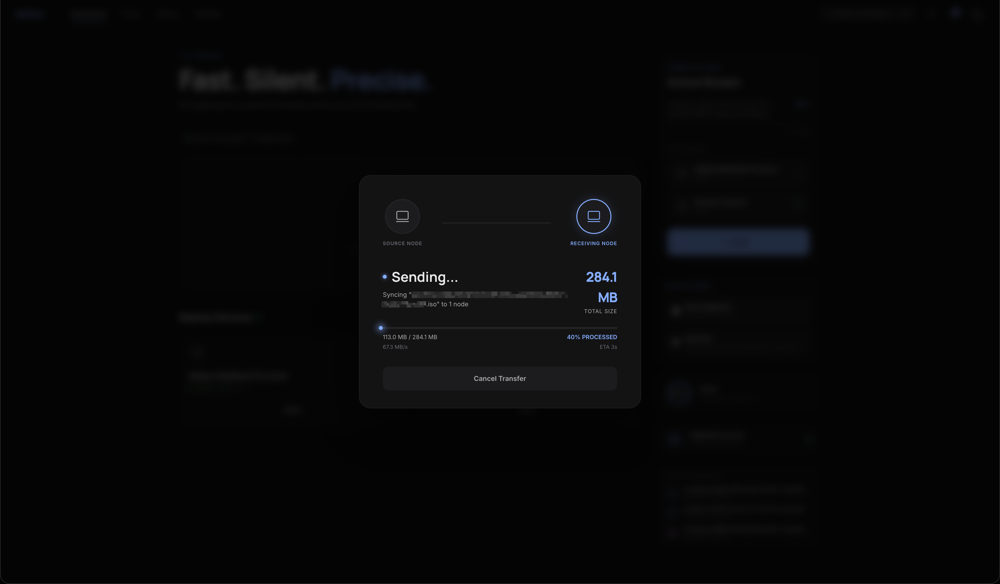
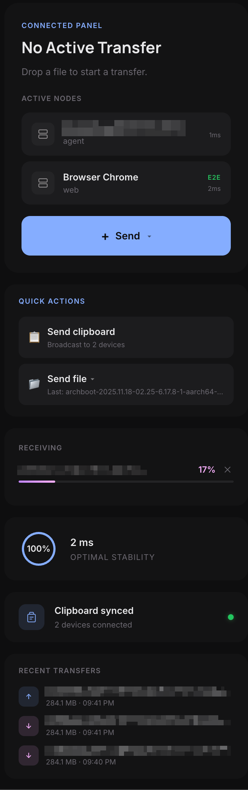
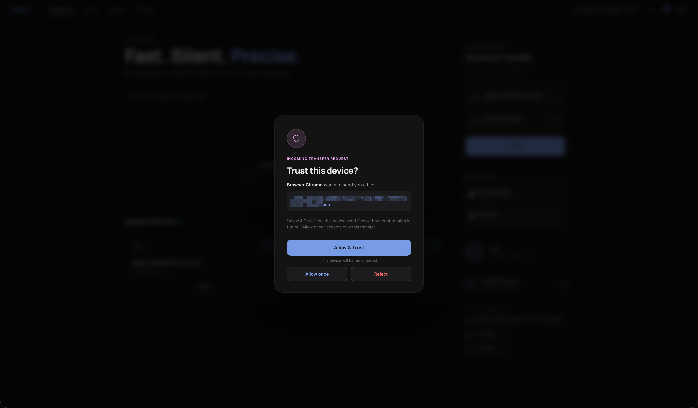
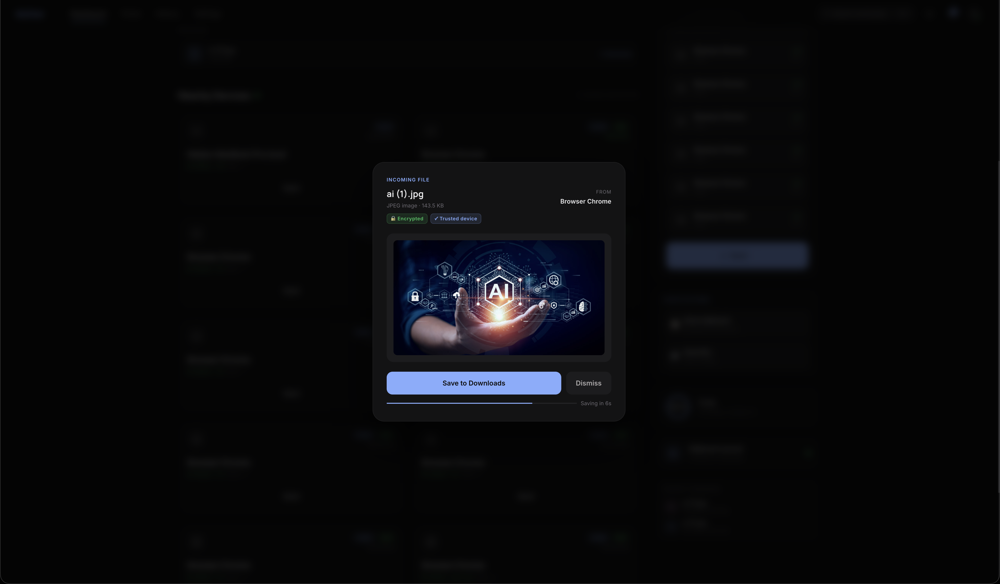
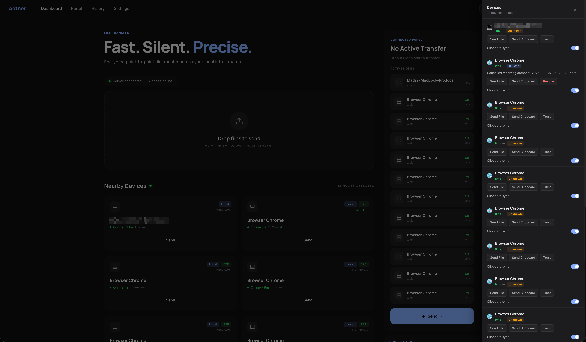

# Aether

Fast. Silent. Precise.  
LAN-first file & clipboard sync — no cloud, no accounts, no friction.

---

## What it does

Drop a file onto a device. It arrives.  
Copy something on your phone. It's on your Mac.

---

## File transfer



- Chunked transfer (512 KB)
- Real-time speed + ETA
- Cancel anytime

---

## Clipboard sync



- Bidirectional sync
- Direct system clipboard integration

---

## Security & trust



- End-to-end encryption (ECDH P-256 + AES-256-GCM)
- Trust devices once, always, or per transfer

---

## Preview & UX



- Image, text, and metadata preview
- Auto-save after 8 seconds

---

## Device intelligence



- Real-time latency & connection health
- LAN-aware device detection
- Connection age + stability indicators

---

## Stack

```
apps/web      React 19 + Vite + TypeScript    Dashboard UI
apps/server   Fastify + ws                    WebSocket broadcaster
apps/agent    Node.js + clipboardy            Clipboard + file daemon
apps/e2e      Playwright                      E2E test suite
packages/types                                Shared TypeScript types
```

pnpm workspaces + Turborepo.

## Running

```bash
pnpm install
pnpm dev          # starts web + server + agent concurrently
```

Or individually:

```bash
cd apps/server && pnpm dev    # :3000 HTTP + :3001 WS
cd apps/web    && pnpm dev    # :5173
cd apps/agent  && pnpm dev    # clipboard daemon
```

Point the agent at a different server:

```bash
# Example
AETHER_SERVER=ws://192.168.x.x:3001 AETHER_NAME=my-mac pnpm dev
```

## Testing

```bash
# Run all e2e tests (requires dev server running)
pnpm --filter @aether/e2e exec playwright test

# Other modes
pnpm --filter @aether/e2e exec playwright test --ui
pnpm --filter @aether/e2e exec playwright test --headed
```

Tests cover: peer discovery, E2E encryption badge, file transfer (accept / reject / cancel), trust flow, clipboard sync. All run serially against the shared dev server.

## HTTPS / mobile

Vite uses mkcert certificates (`apps/web/certs/`). Android Chrome auto-upgrades QR-scanned URLs to HTTPS — install the mkcert root CA on mobile to avoid certificate warnings.

## Architecture

See [`docs/how-it-works.md`](docs/how-it-works.md) for protocol details, encryption flow, message types, and component architecture.
